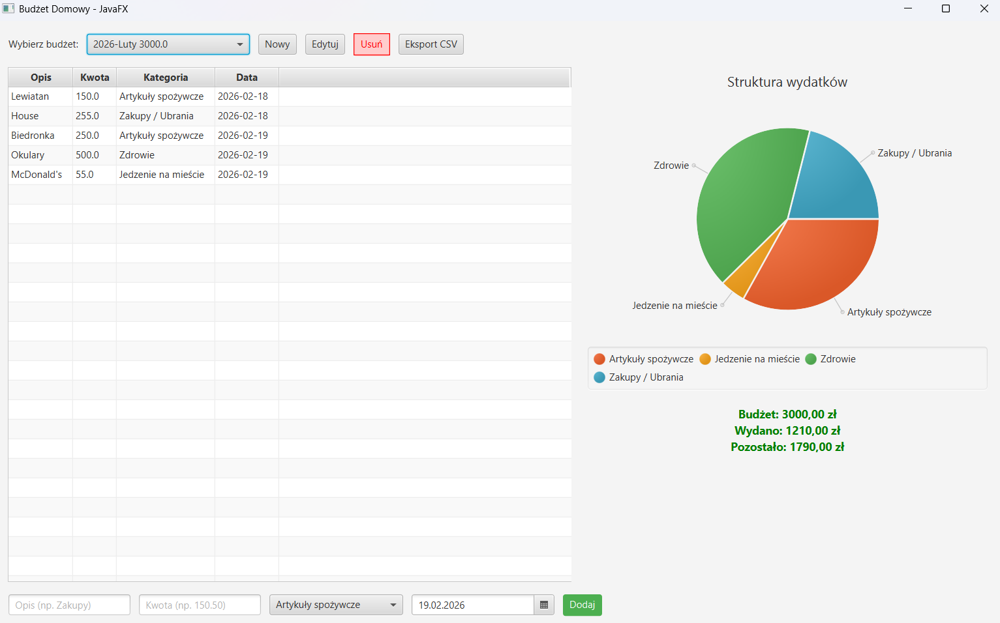

# 💰 Home Budget Manager 📊

A desktop application built with **Java** ☕ and **JavaFX** 🖼️ that helps users track their monthly budgets, manage expenses, and analyze their spending habits. The app uses **PostgreSQL** 🐘 for data persistence and features an intuitive graphical user interface ✨.

## 📸 Preview


## 🚀 Features
* 📅 **Monthly Budget Management**: Create, edit, and delete monthly budgets with an initial balance.
* 💸 **Expense Tracking**: Add, update, and remove expenses for specific budgets.
* 🏷️ **Categorization**: Group expenses into predefined categories (Groceries 🛒, Housing 🏠, Transport 🚗, Entertainment 🍿, etc.).
* 📈 **Visual Analytics**: Real-time generation of pie charts representing your spending structure.
* ⚖️ **Balance Calculation**: Automatically tracks total spent amount and remaining balance.
* 📄 **CSV Export**: Export all expenses from a selected month directly to a `.csv` file for external analysis.

## 🛠️ Tech Stack
* ☕ **Language**: Java
* 🖥️ **GUI Framework**: JavaFX
* 🗄️ **Database**: PostgreSQL
* 🔌 **Database Access**: JDBC
* 🏗️ **Architecture**: MVC-inspired (Model, Repository, Service, UI)

## ⚙️ Setup and Installation

### 📌 Prerequisites
1. ☕ **Java Development Kit (JDK)** 11 or higher.
2. 🧩 **JavaFX SDK** configured in your IDE.
3. 🐘 **PostgreSQL** server running locally.

### 🗃️ Database Configuration
1️⃣ Create a new PostgreSQL database named `monthly_budgets_db`.  
2️⃣ Run the following SQL script to set up the required tables:

```sql
CREATE TABLE monthly_budgets (
    id SERIAL PRIMARY KEY,
    year INT NOT NULL,
    month_name VARCHAR(50) NOT NULL,
    initial_balance DOUBLE PRECISION NOT NULL
);

CREATE TABLE expenses (
    id SERIAL PRIMARY KEY,
    description VARCHAR(255) NOT NULL,
    amount DOUBLE PRECISION NOT NULL,
    date DATE NOT NULL,
    budget_id INT REFERENCES monthly_budgets(id) ON DELETE CASCADE,
    category VARCHAR(50) NOT NULL
);
```

3️⃣ If your PostgreSQL credentials differ from the defaults, update the DatabaseConnection.java file:
``` java
private static final String URL = "jdbc:postgresql://localhost:5432/monthly_budgets_db";
private static final String USER = "your_username";
private static final String PASSWORD = "your_password";
```
## ▶️ Running the App
Run the BudgetApp.java file from your IDE 💻, ensuring that your VM options for JavaFX are properly set (e.g., --module-path /path/to/javafx/lib --add-modules javafx.controls,javafx.fxml).

